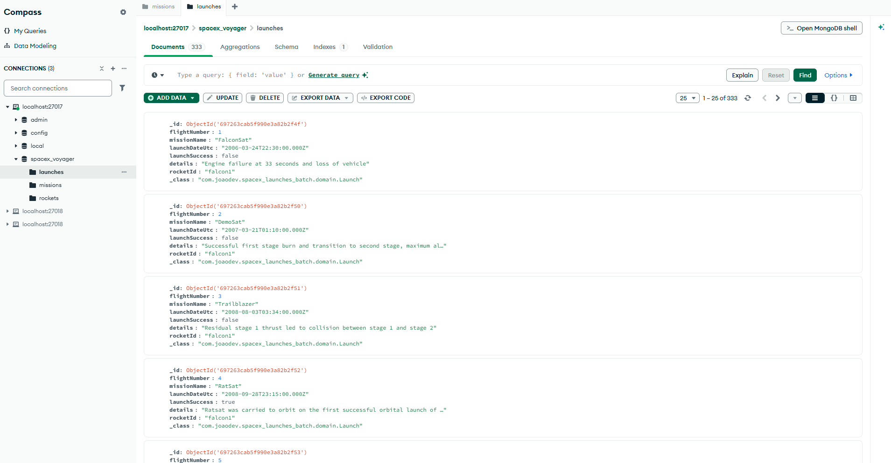

# 🚀 SpaceX Data Voyager

 
  
  
  
  
  

 

**SpaceX Data Voyager** é uma aplicação de processamento em lote (**Batch Processing**) robusta, projetada para extrair, filtrar e transformar dados técnicos da API oficial da SpaceX para armazenamento otimizado em larga escala.

## 📌 Sobre o Projeto

O projeto demonstra a implementação de um pipeline **ETL** (Extract, Transform, Load) utilizando o ecossistema Spring. A aplicação gerencia fluxos complexos de dados entre diferentes tipos de bancos (Relacional e NoSQL) e serviços externos, garantindo integridade e auditabilidade através de metadados.

### ✨ Destaques Técnicos
* **Processamento Orientado a Chunks**: Processamento eficiente de dados em lotes configuráveis, otimizando o consumo de memória.
* **Arquitetura Poliglota**: Integração simultânea com **MySQL** para controle de estado do Job e **MongoDB** para persistência de documentos.
* **Mapeamento de Domínio**: Uso de DTOs para desacoplar a API externa do modelo de dados interno do sistema.
* **Auditabilidade**: Rastreamento completo de execuções, falhas e reinicializações através das tabelas de metadados do Spring Batch.

## ☁️ Infraestrutura e Execução

O sistema utiliza containers Docker para garantir que o ambiente de execução seja idêntico em qualquer máquina, orquestrando três serviços essenciais.

* **MySQL 8**: Repositório de metadados (`spacex_metadata`) rodando na porta padrão `3306`.
* **MongoDB**: Banco NoSQL rodando na porta `27017` para armazenamento da coleção `rockets`.
* **phpMyAdmin**: Interface web na porta `8081` para monitoramento das tabelas de controle do Job.

### Desafios Superados
- **Gestão de Portas**: Migração de portas customizadas para portas padrão de mercado visando compatibilidade total com ferramentas de monitoramento.
- **Transformação de Dados**: Implementação de lógica de processamento para filtrar apenas campos críticos (ID, Nome, Status e Descrição) de uma resposta JSON complexa.

## 🎯 Competências Desenvolvidas

Este projeto consolidou os seguintes conhecimentos práticos:

- [x] Implementação de **Spring Batch Jobs** e **Steps**.
- [x] Configuração de **Múltiplos DataSources** (JDBC e MongoDB).
- [x] Consumo de APIs REST com **RestTemplate**.
- [x] Modelagem de documentos NoSQL e documentos de domínio Java.
- [x] Orquestração de serviços com **Docker Compose**.

---

🧭 Roadmap e Próximos Passos

O SpaceX Data Voyager foi concebido como um projeto evolutivo, permitindo expansão incremental sem comprometer a arquitetura existente. Os próximos passos planejados visam aprofundar conceitos de sistemas distribuídos, integração de dados e exposição de APIs robustas.

🔜 Evoluções Planejadas

Microsserviço de Lançamentos (Launch Service)
Criação de um novo serviço responsável por consumir e persistir dados de lançamentos da SpaceX, mantendo desacoplamento entre foguetes, lançamentos e missões.

Correlação de Domínio (Rocket ↔ Launch ↔ Mission)
Implementação de um pipeline que relacione foguetes aos seus lançamentos e respectivas missões, permitindo consultas mais ricas e contextualizadas.

Exposição de API REST com HATEOAS
Disponibilização dos dados processados via API REST seguindo princípios RESTful, com suporte a Spring HATEOAS para navegação guiada por hipertexto.

Enriquecimento Visual dos Dados
Inclusão de URLs de imagens oficiais da SpaceX para tornar a API mais amigável para consumo por aplicações frontend ou dashboards.

Separação por Microsserviços
Evolução da arquitetura para múltiplos serviços independentes:

Serviço de ingestão Batch

Serviço de consulta de foguetes

Serviço de lançamentos e missões

Testes Automatizados
Introdução gradual de:

Testes unitários (JUnit 5, Mockito)

Testes de integração para Jobs Batch

Validação de pipelines ETL

Observabilidade (futuro)
Possível integração com logs estruturados e métricas para análise de performance e falhas em execuções Batch.

🎯 Objetivo do Roadmap

O foco das evoluções é consolidar fundamentos sólidos de backend, como:

processamento em lote,

integração entre sistemas heterogêneos,

modelagem de domínio,

e arquitetura escalável.

Desenvolvido por João Dev. 🚀
